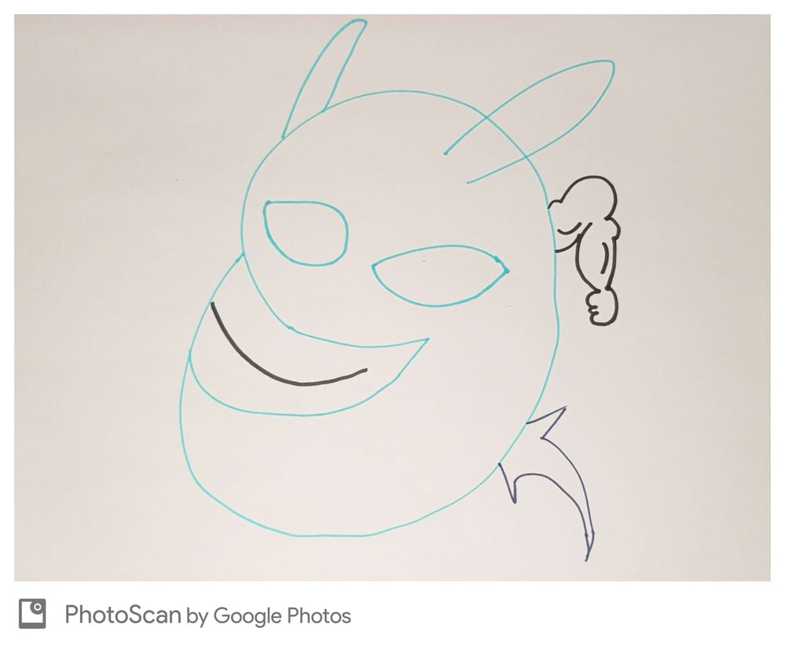

# dablob
What if it was blob?

- String?
- Integer?
- Float?

*IT COULD BE!?*



[Credits For dablob Mascot Are To TheLetterZed HE Drew This All By Himself Please Go Subscribe To His Channel](https://github.com/theletterzed)

## Usage

### makeblob
```
./dablob makeblob
Enter a thing to be blobbed:
3.333333
9 bytes worth of blob
3.333333 will be blobbed
Blobbed Float
```

### deblob
```
./dablob deblob
Enter a thing to be deblobbed:
int.blob 
int.blob will be deblobbed
opened int.blob
32
```

## Compile Instructions
Why would you?
